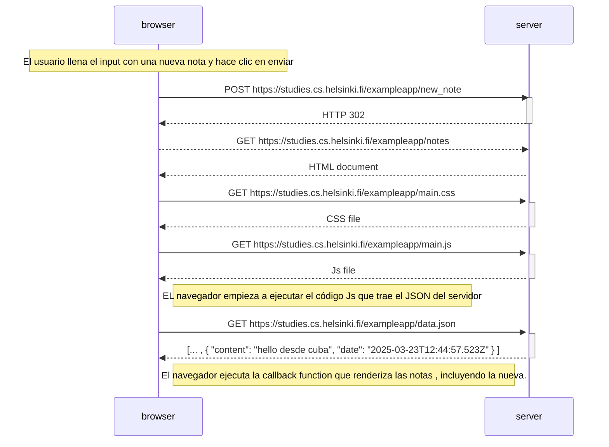

```mermaid
sequenceDiagram
    participant browser
    participant server

     Note over browser: El usuario llena el input con una nueva nota y hace clic en enviar

    browser->>server: POST https://studies.cs.helsinki.fi/exampleapp/new_note
    activate server
    server-->>browser: HTTP 302
    deactivate server

    browser-->>server: GET https://studies.cs.helsinki.fi/exampleapp/notes
    activate server
    server-->>browser: HTML document

    browser->>server: GET https://studies.cs.helsinki.fi/exampleapp/main.css
    activate server
    server-->>browser:  CSS file
    deactivate server

    browser->>server: GET https://studies.cs.helsinki.fi/exampleapp/main.js
    activate server
    server-->>browser: Js file
    deactivate server

    Note right of browser: EL navegador empieza a ejecutar el código Js que trae el JSON del servidor

    browser->>server: GET https://studies.cs.helsinki.fi/exampleapp/data.json
    activate server
    server-->>browser: [... , { "content": "hello desde cuba", "date": "2025-03-23T12:44:57.523Z" } ]
    deactivate server

    Note right of browser: El navegador ejecuta la callback function que renderiza las notas , incluyendo la nueva.
```