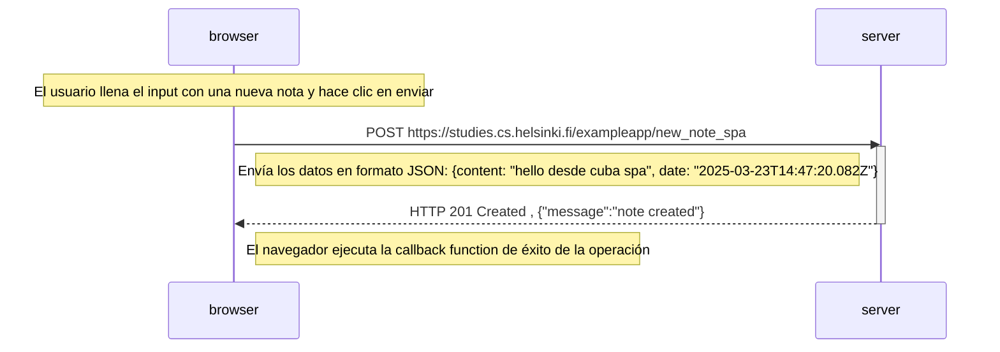

```mermaid
sequenceDiagram
    participant browser
    participant server

     Note over browser: El usuario llena el input con una nueva nota y hace clic en enviar

    browser->>server: POST https://studies.cs.helsinki.fi/exampleapp/new_note_spa
    activate server
    Note right of browser: Envía los datos en formato JSON: {content: "hello desde cuba spa", date: "2025-03-23T14:47:20.082Z"}
    server-->>browser: HTTP 201 Created , {"message":"note created"}
    deactivate server

    Note right of browser: El navegador ejecuta la callback function de éxito de la operación
```